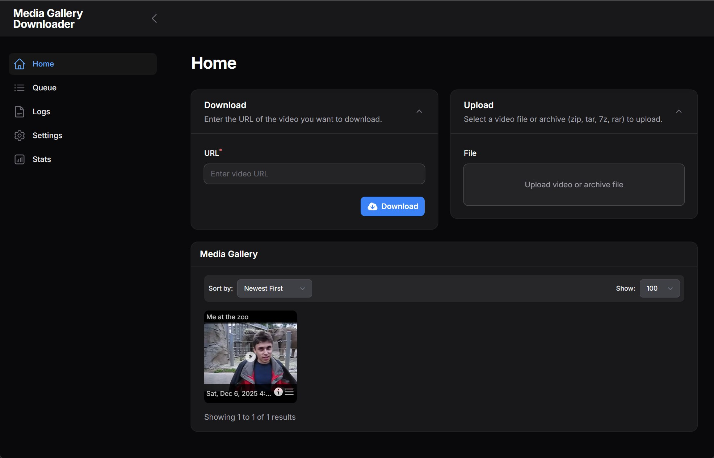

# Media Gallery Downloader

A web application built with Laravel and FrankenPHP for downloading and managing media content from various online sources.



## Features

- **Multi-source Media Downloading**: Download content from various online platforms
- **Direct File Upload**: Upload local media files directly to the gallery
- **Gallery Management**: Organize downloaded media in a gallery interface
- **Readable Filenames**: Files are stored as `<title>-<timestamp>.<ext>` (see [Media Filenames](docs/CONFIGURATION.md#media-filenames))
- **High Performance**: Built on FrankenPHP for optimal performance
- **Secure**: Rootless containerized deployment with proper security headers
- **Responsive Design**: Works seamlessly on desktop and mobile devices
- **Background Processing**: Queue-based processing for downloads and uploads
- **SQLite Database**: Lightweight, file-based database for easy deployment

## Technology Stack

- **Backend**: Laravel 12, PHP 8.4, FrankenPHP
- **Frontend**: Filament 3, Alpine.js, Tailwind CSS v4
- **Frontend Build**: Deno + Vite + Laravel Vite Plugin
- **Unit Testing**: Pest PHP
- **Acceptance Testing**: Deno with Playwright
- **Database**: SQLite
- **Web Server**: Caddy (via FrankenPHP)
- **Container**: Docker with multi-stage builds
- **Process Management**: Supervisor for background services

## Prerequisites

- Docker and Docker Compose
- Linux/macOS/Windows with WSL2

## Quick Start

The fastest way — download the management script and install:

```bash
curl -fsSL https://raw.githubusercontent.com/media-gallery-downloader/media-gallery-downloader/master/mgd.sh -o mgd.sh
chmod +x mgd.sh
./mgd.sh install
```

### Management Commands

```bash
./mgd.sh              # Show available commands
./mgd.sh install      # Fresh install (downloads docker-compose.yml and .env)
./mgd.sh update       # Pull latest image and restart
./mgd.sh up           # Create and start containers
./mgd.sh down         # Stop and remove containers
./mgd.sh start        # Start existing containers
./mgd.sh stop         # Stop containers (without removing)
./mgd.sh logs         # View logs
./mgd.sh fixperms     # Fix storage directory permissions
./mgd.sh selfupdate   # Update the mgd.sh script
```

## Manual Setup

The manual way to run Media Gallery Downloader using the pre-built Docker image from GitHub Container Registry.

### 1. Create Project Directory

```bash
mkdir media-gallery-downloader && cd media-gallery-downloader
```

### 2. Download Docker Compose File

```bash
curl -O https://raw.githubusercontent.com/media-gallery-downloader/media-gallery-downloader/master/docker-compose.yml
```

### 3. (Optional) Configure Environment

To customize settings like port, timezone, or data paths:

```bash
curl -O https://raw.githubusercontent.com/media-gallery-downloader/media-gallery-downloader/master/.env.docker.example
mv .env.docker.example .env
```

Edit `.env` to adjust settings. See [Environment Variables](docs/DEPLOYMENT.md#environment-variables) for available options.

### 4. Start the Application

```bash
docker compose up -d
```

## Access the Application

- **HTTP**: <http://localhost:8080>

The application serves HTTP only by default. For HTTPS, place behind a reverse proxy (see below).

The application will automatically:

- Set up the database
- Run migrations and seeders
- Start background services

## Security

> [!WARNING]
> **This application has no built-in authentication.** The admin panel and all of
> its pages — Home, Settings, Logs, Queue, media management — as well as the
> media-delete and database-backup-download routes are accessible to anyone who
> can reach the app over the network. The app is designed to run on a trusted,
> private network.
>
> **Do NOT expose this app directly to the public internet.** Put it behind an
> authentication layer such as:
>
> - Reverse-proxy basic auth (Caddy `basicauth`, nginx `auth_basic`)
> - An identity-aware proxy (Authelia, Authentik, oauth2-proxy)
> - A private network / VPN (Tailscale, WireGuard)
>
> See [Using a Reverse Proxy](docs/DEPLOYMENT.md#using-a-reverse-proxy-recommended-for-production)
> for a starting point.

## Documentation

- **[Deployment](docs/DEPLOYMENT.md)** — production setup, environment variables, reverse proxy, updating.
- **[Backup & Restore](docs/BACKUP.md)** — creating and downloading backups, restoring, migrating to a new server.
- **[Configuration](docs/CONFIGURATION.md)** — editing media & tags, authentication cookies, yt-dlp options, filenames, playback & hardware re-encoding.
- **[Bulk Import](docs/BULK_IMPORT.md)** — importing large numbers of files from a directory.
- **[Development](docs/DEVELOPMENT.md)** — architecture, local development, frontend build, linting, testing.

## AI Disclaimer

See [AI_DISCLAIMER.md](AI_DISCLAIMER.md) for information about AI assistance used in development.

## License

This project is licensed under the MIT License - see the [LICENSE](LICENSE) file for details.

## Legal Notice

This application automatically downloads and utilizes the following third-party software at runtime:

- **yt-dlp**: Licensed under The Unlicense (Public Domain). Automatically downloaded from GitHub releases for media downloading functionality.
- **Deno**: Licensed under MIT License. Automatically downloaded from GitHub releases for frontend build tooling.
- **FFmpeg**: Licensed under LGPL v2.1+ (or GPL v2.1+ depending on build configuration). Installed via system package manager during container build.

**Important**: These tools are not distributed with this application but are automatically obtained during installation/runtime. Users are responsible for:

1. Ensuring compliance with the licensing terms of downloaded components
2. Verifying that their use complies with the terms of service of any websites or platforms from which they download content
3. Compliance with applicable copyright and intellectual property laws in their jurisdiction
4. Understanding that some FFmpeg codecs may have patent restrictions

By using this software, you acknowledge that you are responsible for the legal implications of downloading and using media content.
